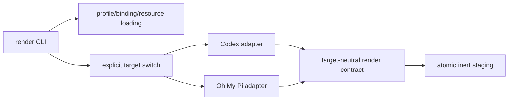

# Adapter architecture

`profile-mango` has one canonical profile domain and small, target-owned renderers.
The render path is intentionally an ordinary fixed boundary, not a plugin registry or
application engine.

## Ownership

- `pkg/profilemango` owns canonical parsing, inheritance, route bindings, and
  resource digests.
- `pkg/render` owns the smallest two-consumer boundary: `TargetBuild`, pure
  input/resource types, evidence, capabilities, artifacts, report serialization,
  stable sorting, safe artifact paths, and resource-byte validation.
- `pkg/adapters/codex` and `pkg/adapters/ohmypi` own exact evidence pins, target
  syntax, capability mapping, target-specific diagnostics, and applicability.
- `cmd/profile-mango/render.go` owns common input loading, an explicit switch over
  the known target names, report output, and staging through `internal/staging`.
- `internal/staging` creates only a new explicit output directory and never writes
  a target home.

## Dispatch and failure behavior

The CLI selects a known adapter before reading profile, binding, or resource
inputs. Unknown target names produce a target-neutral `RenderReport` with a
`render.target.unsupported` error and no target-specific artifacts. Known adapters
still fail closed for missing or mismatched exact versions, evidence hashes,
authentication identity, delivery, precedence, permissions, tools, or enforcement.

A preview artifact is an inert candidate only. `applicable` remains false whenever a
required property is unverified, and the command returns nonzero. Candidate config
files use `preview/` paths and report metadata excludes artifact bytes. Resource
copies are content-addressed and validated against the canonical digest before they
are staged.

## Current target boundary

Codex `0.154.0` and Oh My Pi `18.2.6` each have deterministic inert preview
renderers. Codex uses TOML candidate syntax. Oh My Pi uses the pinned source's
YAML settings fields for a `modelRoles.default` and `defaultThinkingLevel`
candidate. Neither adapter claims native applicability, installs output, reads a
target home, accesses credentials, starts a session, calls a provider, or uses a
network connection.

Oh My Pi's source-level version observation is exact, but the standalone build is
currently blocked by its missing pinned native addon and the reviewed `config`
commands initialize settings, discovery, and migration paths. That is recorded as
an explicit support blocker rather than bypassed by running the unsafe inspector.
See [target evidence](target-evidence.md) and the [Oh My Pi reference](agents/oh-my-pi.md)
for the provenance and effect details.
