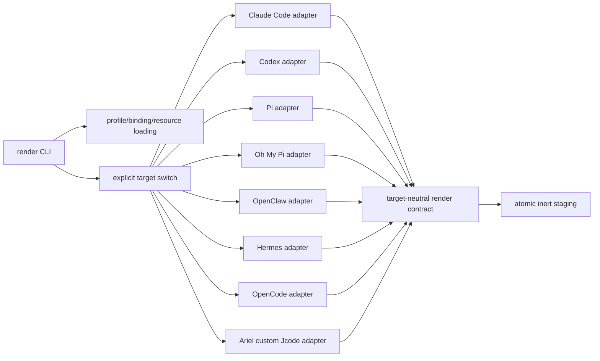

# Adapter architecture

`profile-mango` has one canonical profile domain and small, target-owned renderers.
The render path is intentionally an ordinary fixed boundary, not a plugin registry or
application engine.

## Ownership

- `pkg/profilemango` owns canonical parsing, inheritance, route bindings, and
  resource digests.
- `pkg/render` owns the target-neutral boundary: `TargetBuild`, pure
  input/resource types, evidence, capabilities, artifacts, report serialization,
  stable sorting, safe artifact paths, and resource-byte validation.
- `pkg/adapters/claudecode`, `pkg/adapters/codex`, `pkg/adapters/pi`,
  `pkg/adapters/ohmypi`, `pkg/adapters/openclaw`, `pkg/adapters/hermes`,
  `pkg/adapters/opencode`, and
  `pkg/adapters/arieljcode` own exact evidence pins, target syntax, capability
  mapping, target-specific diagnostics, and applicability. The Ariel package is
  experimental-only and is not an upstream Jcode adapter.
- `cmd/profile-mango/render.go` owns common input loading, an explicit switch over
  the known target names, report output, and staging through `internal/staging`.
- `internal/staging` creates only a new explicit output directory and never writes
  a target home.

## Dispatch and failure behavior

The CLI selects a known adapter before reading profile, binding, or resource
inputs. Unknown target names produce a target-neutral `RenderReport` with a
`render.target.unsupported` error and no target-specific artifacts. Known adapters
still fail closed for missing or mismatched exact versions, evidence hashes,
authentication identity, delivery, precedence, permissions, tools, or enforcement.

A preview artifact is an inert candidate only. `applicable` remains false whenever a
required property is unverified, and the command returns nonzero. Candidate config
files use `preview/` paths and report metadata excludes artifact bytes. Resource
copies preserve their original relative paths and are validated against the
canonical digest before they are staged.

## Current target boundary

Claude Code `2.1.278`, Codex `0.154.0`, Pi `0.86.1`, Oh My Pi `18.2.6`,
OpenClaw `2026.9.5`, Hermes Agent `0.21.3`, and OpenCode `1.18.31` each have deterministic inert
preview renderers. Ariel's custom Jcode fork `jcode v0.83.909-dev (ca8017a3a)`
also has a deterministic inert TOML renderer under the explicit target identity
`ariel-jcode`, but it is experimental-only and not publicly supported. Claude Code emits a documentation-context JSON `model`
candidate. Codex uses TOML candidate syntax. Pi uses exact source-grounded JSON
settings keys `defaultProvider`, `defaultModel`, and `defaultThinkingLevel`.
Oh My Pi uses the pinned source's YAML settings fields for a `modelRoles.default`
and `defaultThinkingLevel` candidate. OpenClaw uses source-grounded JSON5 fields
for `agents.defaults.model.primary`, an explicit empty fallback list, and
`agents.defaults.thinkingDefault`. Hermes uses source-grounded YAML fields for
`model.provider`, `model.default`, and `agent.reasoning_effort`. OpenCode emits only
the exact-release source-grounded JSONC `model` field in `provider/model` form;
effort, authentication, delivery, precedence, and enforcement remain blocked. None of these
adapters claims native applicability, installs output into a production target, reads a target home, accesses
credentials, starts a session, calls a provider, or uses a network connection during
ordinary render/install operation. The install engine is exercised with fake adapters
and synthetic temporary files only; every production adapter remains install-blocked
pending `ap-6fu.11` and fresh user approval.

The Ariel renderer uses only the exact retained synthetic profile-resolution
evidence for provider/model/effort, closed tool selectors, empty-skill mode,
canonical skill selectors, and instruction metadata. It rejects unsupported
canonical policy shapes and does not accept arbitrary target-owned keys. The
tested build hash and the separate documentation snapshot are recorded in the
[target evidence ledger](target-evidence.md); neither establishes upstream
Jcode compatibility.

Claude Code's immutable npm package and release commit are pinned, but its opaque
native startup and diagnostic paths were not proven side-effect-free. No native
Claude Code command was run. The adapter keeps native acceptance, effective state,
precedence, route/auth, permissions/tools, CLAUDE.md, skills, and enforcement
blocked rather than treating mutable documentation as release evidence.

Oh My Pi's source-level version observation is exact, but the standalone build is
currently blocked by its missing pinned native addon and the reviewed `config`
commands initialize settings, discovery, and migration paths. That is recorded as
an explicit support blocker rather than bypassed by running the unsafe inspector.
See [target evidence](target-evidence.md) and the [Oh My Pi reference](agents/oh-my-pi.md)
for the provenance and effect details.

OpenClaw's exact source/archive identity is pinned, but no dependency install,
runtime build, or native command was run. The reviewed `config validate --json`
path performs plugin/state/include discovery and was not accepted as a safe M0
probe. Those are explicit blockers, not reasons to add a target-home inspector or
plugin framework. See [target evidence](target-evidence.md) and the
[OpenClaw reference](agents/openclaw.md).

Hermes's exact source/archive identity is pinned, but the current system Python
is outside its `>=3.11,<3.14` requirement and no runtime was built. The reviewed
`config get`, `status`, and `profile show` paths load dotenv, credential, profile,
plugin, gateway, and session state before or during inspection, so no native
Hermes command was accepted as a safe M0 probe. See [target evidence](target-evidence.md)
and the [Hermes reference](agents/hermes.md).

Pi's exact `v0.86.1` source commit, npm package tarball, registry integrity, and
bundled `dist/bundle/cli.js` entrypoint hashes are pinned. Static review found
startup settings/auth/model/session paths, project and extension discovery,
migrations, package/update subprocesses, network-capable model/catalog paths, and
write surfaces. No Pi native command was run because those paths were not proven
bounded in a credential-free, no-write, noninteractive isolation. Native config
acceptance, effective state, precedence, authentication, delivery, and
enforcement remain blocking. See [target evidence](target-evidence.md) and the
[Pi reference](agents/pi.md).
